<a href="https://just-dashboard.com"></a>
Install

```bash
git clone https://github.com/JustDashboard/Just-Dashboard.git
cd Just-Dashboard && sudo ./install.sh
```
What's inside
Deploys from a repository, an image, a template or a Compose file, with rollback.
Databases you can browse, query, diagram and hand out.
Templates for PostgreSQL, Redis, n8n, Grafana, Uptime Kuma, Ollama and more.
Push to deploy, with pull-request previews and notifications.
Backups that know what isn't backed up.
A real shell, a file manager and every Git checkout on the disk.
Private by default: Tailscale or an SSH tunnel, two-factor and an audit log.
Support
Just Dashboard is free, and every feature stays free. If it has saved you an evening, there's a Buy Me a Coffee page.
<a href="https://buymeacoffee.com/ionmoisei72"></a>
Want to sponsor the project? Write to ionmoisei755@gmail.com.
Links
just-dashboard.com · Repository · Built by @Wayy01
